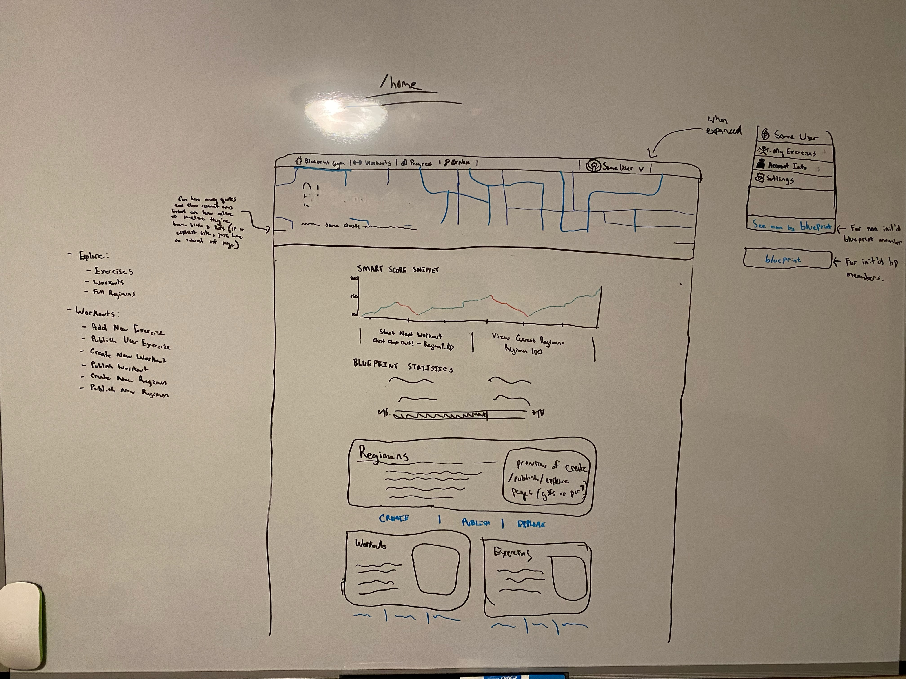

# Homepage (Design)

## Description

_The homepage is the first place a member will go after logging in or signing up. We should be able to navigate to all high level features of the app from here in an easy and obvious way._

## Mock

</img>

- The smart score should always be going up. Lets do a list of the smart scores recorded over time and use those as data points. Maybe every time we submit a workout we can recalculate this. I guess this would have to go to the Gym Member Statistics Service.

## DTOs + ViewModels > DTOs + ViewModels > Frontend Services > MicroServices > Controllers > Services > Repositories > DB Models

Views + DTOs

```cs
public class MemberHomepageView
{
  public IEnumerable<int> SmartScoreDataPoints { get; set; }
  public string NextWorkoutId { get; set; }
  public string ActiveRegimenId { get; set; }
}
```

DB Models

```cs
public class MemberState
{
  public string MemberId { get; set; }
  public string PK { get => $"{this.GetType().Name}-{this.MemberId}"; }
  public IEnumerable<int> SmartScoreDataPoints { get; set; }
  public string NextWorkoutId { get; set; }
  public string ActiveRegimenId { get; set; }
}
```

1. On page load:

```ts
GymMemberService.getHomepageView(memberId: string) -> MemberHomepageView
```

^

```
GymMemberService > MemberStateController > MemberStateController:
  - MemberRepository:
    - GetMemberState(string: memberId) -> MemberState

```
