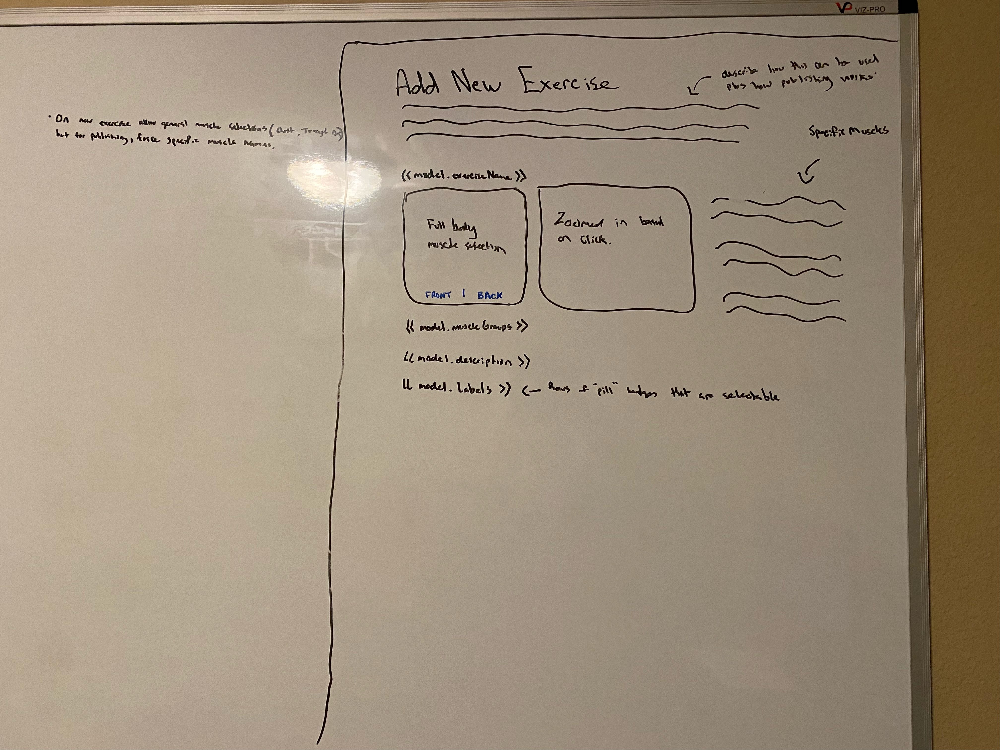
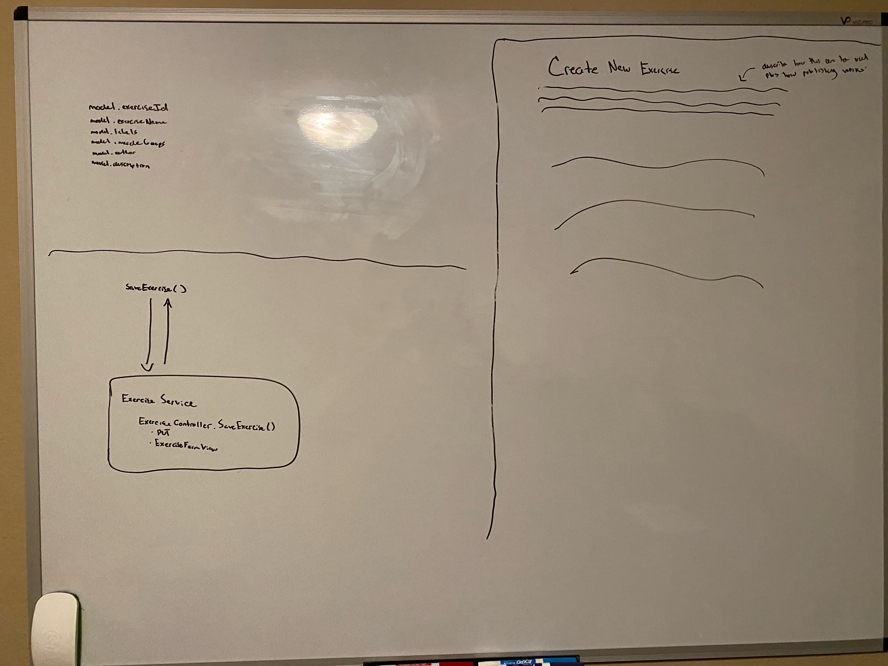

# New Exercise (Design)

## Description

_Page where we add or edit exercises_

## Mock

</img>
</img>

## DTOs + ViewModels > Frontend Services > MicroServices > Controllers > Services > Repositories > DB Models

Views + DTOS

```cs
public class ExerciseFormView
{
  public string ExerciseId { get; set; }
  public string ExerciseName { get; set; }
  public string Description { get; set; }
  public IEnumerable<string> MusclesWorked { get; set; }
  public IEnumerable<string> ExerciseLabels { get; set; }
  public ExerciseState State { get; set; }
  public ExerciseDifficulty Difficulty { get; set; }
  public ExerciseLookupDto? ParentVariationExercise { get; set; }
}

public class ExerciseLookupDto
{
  public string ExerciseId { get; set; }
  public string ExerciseName { get; set; }
  // max length: 100 or so
  public string DescriptionSnippet { get; set; }
  public ExerciseDifficulty Difficulty { get; set; }
  public IEnumerable<string> MusclesWorked { get; set; }
}
```

DB Models

```cs
public class Exercise
{
  public string PK = $"{this.GetType().Name}-{this.State}-{this.ExerciseId}";
  public string ExerciseId { get; set; }
  public string ExerciseName { get; set; }
  public string Description { get; set; }
  public IEnumerable<string> MusclesWorked { get; set; }
  public IEnumerable<string> ExerciseLabels { get; set; }
  public ExerciseState State { get; set; }
  public ExerciseDifficulty Difficulty { get; set; }
  public MemberRef Author { get; set; }
  public string? ParentVariationExerciseId { get; set; }
  public string? ParentVariationExerciseName { get; set; }
}

public class ExerciseRef
{
  public string PK = $"{this.GetType().Name}-{this.State}-{this.ExerciseId}";
  public string ExerciseId { get; set; }
  public string ExerciseName { get; set; }
  public string DescriptionSnippet { get; set; }
  public string MusclesWorked { get; set; }
  public ExerciseDifficulty Difficulty { get; set; }
  public ExerciseState State { get; set; } = ExerciseState.Personal;
}

public class MemberRef
{
  public string MemberId { get; set; }
  public string MemberName { get; set; }
}
```

Constants

```cs
public enum ExerciseState
{
  Personal,
  Published
}

public enum ExerciseSearch
{
  PersonalOnly,
  PublishedOnly,
  All
}

public enum ExerciseDifficulty
{
  Beginner,
  Easy,
  Moderate,
  Advanced,
  Expert,
  Dangerous
}
```

1. When changing the exercise name, do a slow debounce (1-2 second or more) and search both published exercises and user exercises using one endpoint:

```ts
exerciseService.searchAllExercisesByName(text: string) -> Observable<ExerciseLookupDto[]>
```

^

```
ExerciseService > (ExerciseSearch.All) => ExerciseController.SearchExerciseByName(ExerciseSearchType searchType) => ExerciseService:
  - ExerciseRepository:
    - GetAllRefs() -> IEnumerable<ExerciseRef>
```

---

2. When saving Exercise

```ts
exerciseService.saveExerciseForm(form: ExerciseFormView) -> Observable<ExerciseFormView>
```

\/

```
ExerciseService > ExerciseController.Save(ExerciseFormView exercise) > ExerciseService.SaveExerciseForm:
  - ExerciseRepository:
    - UpdateExercise(Exercise exercise)
    - UpdateExerciseRef(ExerciseRef exercise)
```
