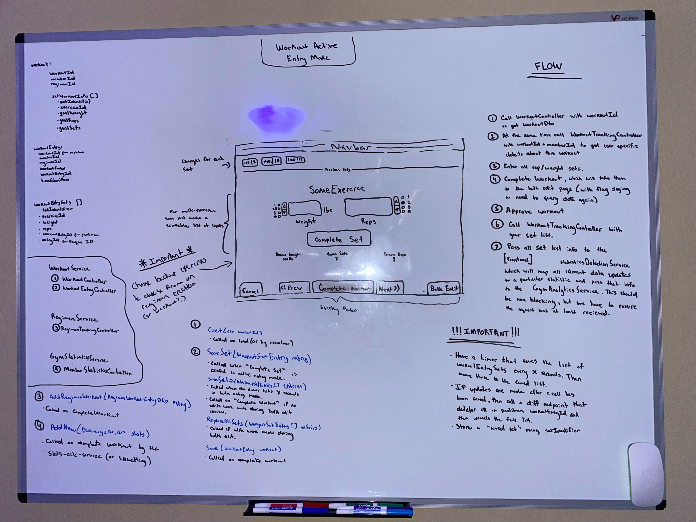

# Workout Active Entry (Design)

## Description

_Page where you input workout sets while working out, making it easy to navigate between the workouts in order and quickly modify weight and reps for easy submission._

## Mock

</img>

- _MISSING_: On complete workout, the endpoint we hit for regimen service, should pull that regimen, and update the **setsLogged**, **workoutsLogged** and **regimenTrend**

  - So in the dto from the frontend include:
    - totalSets
    - totalWorkoutSmartScore
    - muscleToSmartScoreMap (a dictionary of muscle identifiers to the amount of smart score points those muscles identifiers contributed to in this workout)
  - The backend regimen model will have to include most of whats seen from the model in the image above, but also:
    - regimenSmartScore
    - muscleSpecificity

- _MISSING_: for the payload being sent to the GymStatistics Service:

  - addedSmartScorePoint (to update the overall member smart score points list)

    (phase 2)

  - probably in the frontend statistics service we can check against a pre-loaded member context (or it might be mapped to the workout/regimen) which has a list of keys for statistics to track, and based on that we will know what else to send in this dictionary to the stats service.

## DTOs + ViewModels > Frontend Services > MicroServices > Controllers > Services > Repositories > DB Models

Views + DTOS

```cs
public class WorkoutSetFormView
{
  public string EntryId { get; set; }
  public string WorkoutEntryId { get; set; }
  public string SetIdentifier { get; set; }
  public string ExerciseId { get; set; }
  public int AimBonusCutoff { get; set; }
  public ExerciseAim ExerciseAim { get; set; }
  public SpecializedSetType? SpecializedSetType { get; set; }
  public int Weight { get; set; }
  public int Reps { get; set; }
}

public class WorkoutEntryDto
{
  public string WorkoutId { get; set; }
  public string RegimenId { get; set; }
  public int WorkoutIndex { get; set; }
  public string WorkoutEntryId { get; set; }
  public DateTimeOffset TimeSubmitted { get; set; }
  public int PointsEarned { get; set; }
}
```

DB Models

```cs
public class WorkoutEntry
{
  public string PK = $"{this.GetType().Name}-{this.WorkoutId}";
  public string WorkoutId { get; set; }
  public string RegimenId { get; set; }
  public int WorkoutIndex { get; set; }
  public string WorkoutEntryId { get; set; }
  public DateTimeOffset TimeSubmitted { get; set; }
  public int PointsEarned { get; set; }
}

public class WorkoutSetEntry
{
  public string PK = $"{this.GetType().Name}-{this.WorkoutEntryId}";
  public string EntryId { get; set; }
  public string WorkoutEntryId { get; set; }
  public string SetIdentifier { get; set; }
  public string ExerciseId { get; set; }
  public int AimBonusCutoff { get; set; }
  public ExerciseAim ExerciseAim { get; set; }
  public SpecializedSetType? SpecializedSetType { get; set; }
  public int Weight { get; set; }
  public int Reps { get; set; }

}
```

1. Query Workout

```ts
workoutService.get(workoutId: string) -> Observable<WorkoutDto>
```

^

```
WorkoutService > WorkoutController.Get(string workoutId) => WorkoutDto:
  - WorkoutRepository:
    - GetWorkout() -> Workout
```

---

2. When saving WorkoutEntry:

```ts
workoutService.saveWorkoutEntry(workout: WorkoutEntryDto) -> Observable<WorkoutEntryDto>
```

\/

```
WorkoutService > WorkoutEntryController.Save(WorkoutEntryDto workout) > WorkoutEntryService.Save():
  - WorkoutRepository:
    - SaveWorkoutEntry(WorkoutEntry workout)
```

3a. When saving WorkoutSetEntry (Active Entry Mode -> Complete Set click):

```ts
workoutService.saveWorkoutSet(set: WorkoutSetFormView) -> Observable<WorkoutSetFormView>
```

\/

```
WorkoutService > WorkoutEntryController.SaveSet(WorkoutSetFormView set) > WorkoutEntryService.SaveSet():
  - WorkoutRepository:
    - SaveWorkoutSet(WorkoutSetEntry set)
```

3b. When saving WorkoutSets (Bulk Entry Mode -> every X seconds auto save):

```ts
workoutService.saveWorkoutSets(sets: WorkoutSetFormView[]) -> Observable<WorkoutSetFormView[]>
```

\/

```
WorkoutService > WorkoutEntryController.SaveSets(WorkoutSetFormView[] sets) > WorkoutEntryService.SaveSets():
  - WorkoutRepository:
    - SaveWorkoutSets(WorkoutSetEntry[] sets)
```

3c. When saving WorkoutSets at Complete Workout after making "review edits":

```ts
workoutService.replaceAllSets(sets: WorkoutSetFormView[]) -> Observable<WorkoutSetFormView[]>
```

\/

```
WorkoutService > WorkoutEntryController.ReplaceAllSets(WorkoutSetFormView[] sets) > WorkoutEntryService.ReplaceAllSets():
  - WorkoutRepository:
    - ClearWorkoutSets(string workoutEntryId)
    - SaveWorkoutSets(WorkoutSetEntry[] sets)
```
