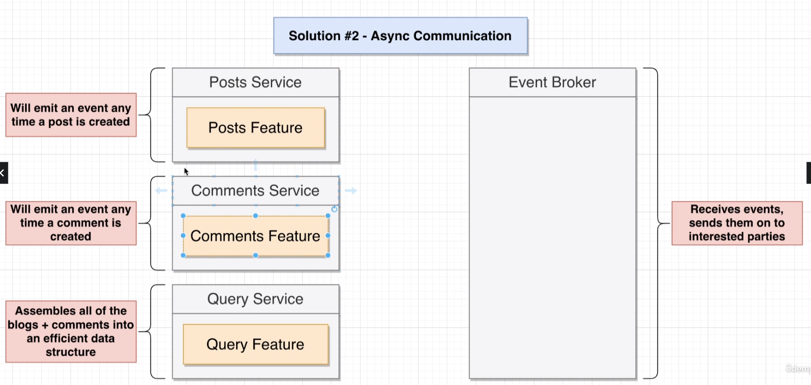

### Communicating between services

1. Sync Communication:

_create a service D that calls service A,B,C and then returns it all at once_

2. Async Communication:

_use an event bus with a separate db for D holding only relevant info_

Example:

A posts service
A comments service

Each posts has multiple comments associated with it, but the posts and comments are submitted/stored separately.

If a user wanted a post with all comments from the frontend, we could create another service (Query Service) that efficiently stores the data and allows it to be queried quickly. So basically a CQRS. Events would be submitted from posts/comments service which are ingested by query service.

---
