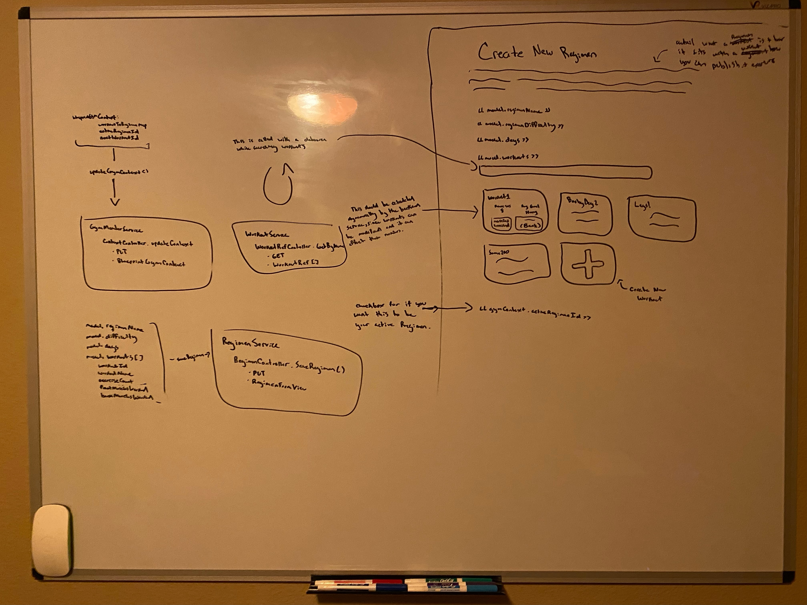

# New Regimen (Design)

## Description

_Page where we add or edit regimens_

## Mock

</img>

- When searching workouts we should only be searching for personal ones (workouts created yourself or ones "claimed" from a template)
- Should be able to view/edit workouts from here then cleanly navigate back with state saved.

## DTOs + ViewModels > Frontend Services > MicroServices > Controllers > Services > Repositories > DB Models

Views + DTOS

```cs
public class RegimenFormView
{
  public string RegimenId { get; set; }
  public string RegimenName { get; set; }
  public Difficulty Difficulty { get; set; }
  public DateTimeOffset StartDate { get; set; }
  public DateTimeOffset EndDate { get; set; }
  public IEnumerable<RegimenWorkoutDto> Workouts { get; set; }
  public MuscleSpecificity MuscleSpecificity { get; set; }
}

public class RegimenWorkoutDto
{
  public string WorkoutId { get; set; }
  public string WorkoutName { get; set; }
  public Difficulty Difficulty { get; set; }
}

public class WorkoutLookupDto
{
  public string WorkoutId { get; set; }
  public string WorkoutName { get; set; }
  public Difficulty Difficulty { get; set; }
  public IEnumerable<string> MusclesWorked { get; set; }
  public WorkoutOrigin WorkoutOrigin { get; set; }
}
```

DB Models

```cs
public class Regimen
{
  public string PK = $"{this.GetType().Name}-{this.MemberId}";
  public string MemberId { get; set; }
  public string RegimenId { get; set; }
  public string RegimenName { get; set; }
  public Difficulty Difficulty { get; set; }
  public DateTimeOffset StartDate { get; set; }
  public DateTimeOffset EndDate { get; set; }
  public IEnumerable<RegimenWorkout> Workouts { get; set; }
  public MuscleSpecificity MuscleSpecificity { get; set; }
}

public class RegimenWorkout
{
  public string WorkoutId { get; set; }
  public string WorkoutName { get; set; }
  public Difficulty Difficulty { get; set; }
}

public class WorkoutRef
{
  public string PK = this.GetType().Name;
  public string WorkoutId { get; set; }
  public string WorkoutName { get; set; }
  public Difficulty Difficulty { get; set; }
  public IEnumerable<string> MusclesWorked { get; set; }
  public WorkoutOrigin WorkoutOrigin { get; set; }
}
```

Constants

```cs
public enum Difficulty
{
  Beginner,
  Easy,
  Moderate,
  Advanced,
  Expert,
  Dangerous
}

public enum WorkoutOrigin
{
  Personal,
  TemplateCopy,
  TemplateOrigin
}

public enum MuscleSpecificity
{
  Basic,
  Focused,
  Trainer
}

```

1. When changing the workout name, do a relatively quick debounce (0.4-0.8 seconds) and search all workout refs:

```ts
workoutService.searchAllWorkoutsByName(text: string) -> Observable<WorkoutLookupDto[]>
```

^

```
WorkoutService > WorkoutController.SearchWorkoutRefsByName(string text) => IEnumerable<WorkoutLookupDto>:
  - WorkoutRepository:
    - GetAllRefs() -> IEnumerable<WorkoutRef>
```

---

2. When saving Regimen

```ts
workoutService.saveRegimenForm(form: RegimenFormView) -> Observable<RegimenFormView>
```

\/

```
WorkoutService > RegimenController.Save(RegimenFormView regimen) > RegimenService.SaveRegimenForm:
  - RegimenRepository:
    - UpdateRegimen(Regimen regimen)
```
