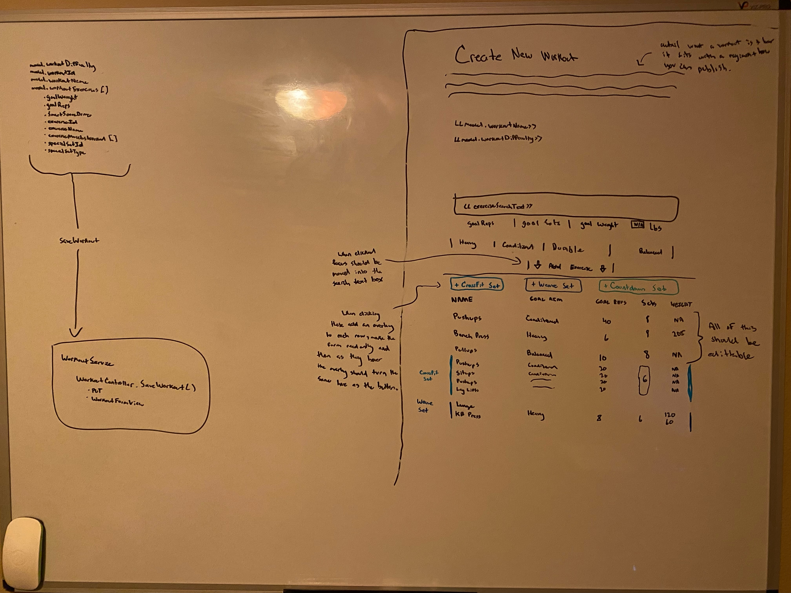

# New Workout (Design)

## Description

_Page where we add or edit workouts_

## Mock

</img>

- _MISSING_: muscleSpecificity field in form (basic, focused, trainer)

## DTOs + ViewModels > Frontend Services > MicroServices > Controllers > Services > Repositories > DB Models

Views + DTOS

```cs
public class WorkoutDto
{
  public string WorkoutId { get; set; }
  public string WorkoutName { get; set; }
  public string MemberId { get; set; }
  public Difficulty Difficulty { get; set; }
  public IEnumerable<WorkoutExerciseAssignmentDto> ExerciseAssignments { get; set; }
  public IEnumerable<ExerciseLinkDto> BackupExercises { get; set; }
}

public class WorkoutFormView : WorkoutDto
{
  // Add form validation etc etc
}

public class WorkoutExerciseAssignmentDto
{
  public int Order { get; set; }
  public string SpecialSetIdentifier { get; set; }
  public string ExerciseId { get; set; }
  public string ExerciseName { get; set; }
  public int AimBonusCutoff { get; set; }
  public ExerciseAim ExerciseAim { get; set; }
  public SpecializedSetType? SpecializedSetType { get; set; }
}

public class ExerciseLinkDto
{
  public string ExerciseId { get; set; }
  public string ExerciseName { get; set; }
}
```

DB Models

```cs
public class Workout
{
  public string PK = $"{this.GetType().Name}-{this.WorkoutId}";
  public string WorkoutId { get; set; }
  public string WorkoutName { get; set; }
  public string MemberId { get; set; }
  public Difficulty Difficulty { get; set; }
  public IEnumerable<WorkoutExerciseAssignment> ExerciseAssignments { get; set; }
  public IEnumerable<ExerciseLink> BackupExercises { get; set; }
}

public class WorkoutExerciseAssignment
{
  public int Order { get; set; }
  public string SpecialSetIdentifier { get; set; }
  public string ExerciseId { get; set; }
  public string ExerciseName { get; set; }
  public int AimBonusCutoff { get; set; }
  public ExerciseAim ExerciseAim { get; set; }
  public SpecializedSetType? SpecializedSetType { get; set; }
}

public class ExerciseLink
{
  public string ExerciseId { get; set; }
  public string ExerciseName { get; set; }
}
```

Constants

```cs
public enum ExerciseAim
{
  Heavy,
  Balanced,
  Conditioned,
  Durable
}

public enum SpecializedSetType
{
  CrossFit,
  Weave,
  Countdown,
  XbyY
}
```

1. When searching the exercise name, do a quick debounce (0.4-0.6 second) and search persona exercises:

```ts
exerciseService.searchExerciseLookupsByName(text: string, searchType: ExerciseSearch) -> Observable<ExerciseLookupDto[]>
```

^

```
ExerciseService > (ExerciseSearch.Personal) => ExerciseController.SearchExerciseByName(ExerciseSearchType searchType) => ExerciseService:
  - ExerciseRepository:
    - GetAllRefs() -> IEnumerable<ExerciseRef>
```

---

2. When saving Workout:

```ts
workoutService.saveWorkoutForm(form: WorkoutFormView) -> Observable<WorkoutFormView>
```

\/

```
WorkoutService > WorkoutController.Save(WorkoutFormView workout) > WorkoutService.SaveWorkoutForm:
  - WorkoutRepository:
    - UpdateWorkout(Workout workout)
```
